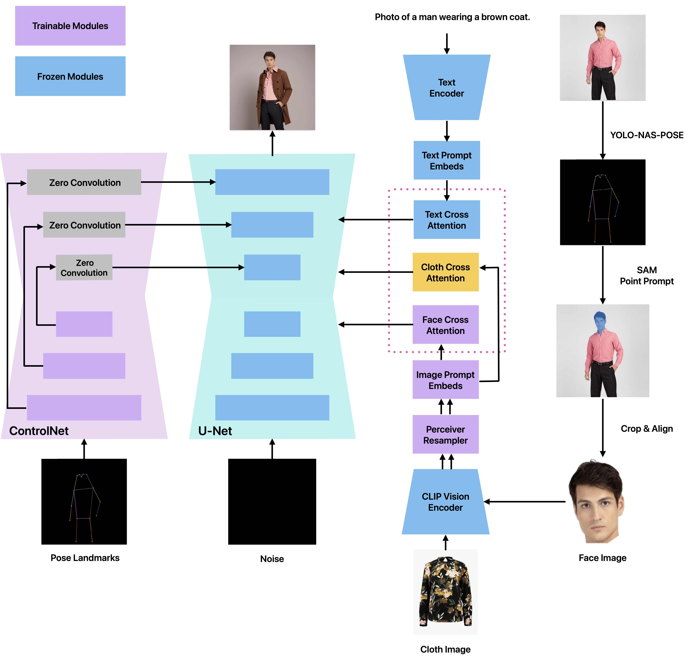
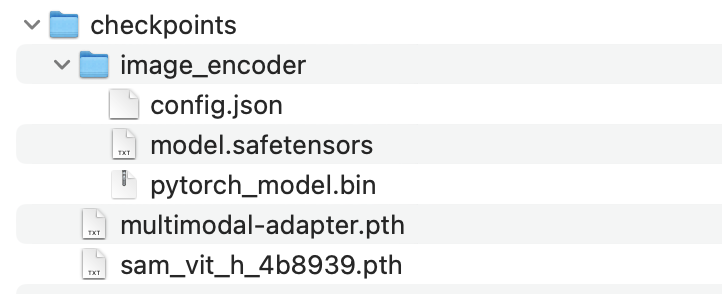
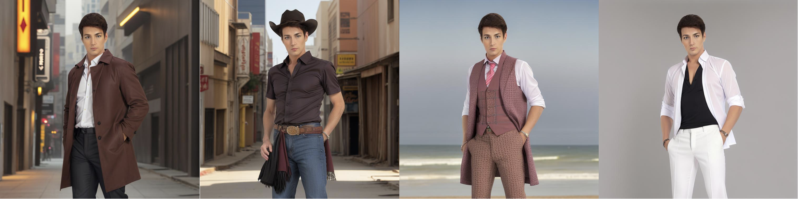
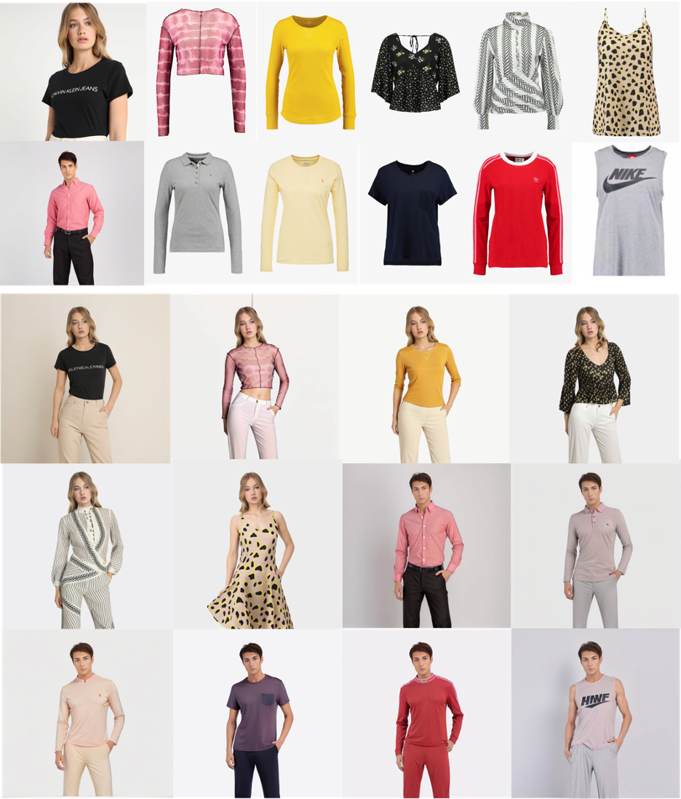

# Generative-Virtual-Try-On

We will make an ambitious attempt to build a project that customizes an generative virtual try-on (VTON) based on any text prompt. The project is in progress, but with some impressive results.


## 1.VTON based on Inpainting pipeline

For this project, we have accomplished the baseline implementation, which is based on the inpainting pipeline provided by [stabilityai](https://huggingface.co/stabilityai/stable-diffusion-2-inpainting) to achieve personalized generative virtual try on by masking the garment area. The pipeline is resumed from [stable-diffusion-2-base](https://huggingface.co/stabilityai/stable-diffusion-2-base) and trained for another 200k steps. Follows the mask-generation strategy presented in [LAMA](https://github.com/advimman/lama).

### Usage

Before running the baseline program, use the [🤗's Diffusers](https://github.com/huggingface/diffusers) library to run Stable Diffusion 2 inpainting in a simple and efficient manner:

```bash
pip install diffusers transformers accelerate scipy safetensors
```

Then run the inpainting pipeline:

```bash
python Baseline_inpainting.py
```
or:

```bash
SAM_+_Stable_Diffusion_Inpainting_Virtue_Try_on.ipynb
```

### Fine-tuning

Although the images generated by the baseline inpainting pipeline achieve virtual try-on to some extent, the performance of the faces and clothing is unsatisfactory. The character's face becomes distorted and the upper body garment appears stiff. Fine-tuning can solve these problems. The project also has built the fine-tune pipeline with Dreambooth + LoRA.

Before running the fine-tuning program, you should download the required environments to ensure the supporting for LoRA:

```bash
pip install -r requirements.txt
```

To run the pipeline applied on Dreambooth and LoRA, please train with the following parameters：

```bash
export MODEL_NAME="stabilityai/stable-diffusion-2-1-base"
export INSTANCE_DIR="./instance_image"
export OUTPUT_DIR="./output"

accelerate launch train_lora_dreambooth.py \
  --pretrained_model_name_or_path=$MODEL_NAME  \
  --instance_data_dir=$INSTANCE_DIR \
  --output_dir=$OUTPUT_DIR \
  --instance_prompt="picture of a sks male model." \
  --train_text_encoder \
  --resolution=512 \
  --train_batch_size=1 \
  --gradient_accumulation_steps=1 \
  --learning_rate=1e-4 \
  --learning_rate_text=5e-5 \
  --color_jitter \
  --lr_scheduler="constant" \
  --lr_warmup_steps=0 \
  --max_train_steps=10000
```

In this baseline project, we use 100 generated images as reference images, and after the fine-tuning, male model's face and cloth presentation can be greatly improved. Actually, the photo of male model after fine-tuning is completely another person from the instance image, which cannot meet the requirements of generative virtual try-on. So, in addition to fine-tuning with Dreambooth and LoRA, some other methods need to be added to preserve the identity. 

## 2.Multimodal Prompt Adapter for Generative Virtual Try-On

We are undertaking an endeavor to build a project that customizes a generative virtual try-on (VTON) based on text and image prompt.  This project uses Stable Diffusion and Controlnet Model to constrain image generation, and leverages the multimodal prompt adapter to make the image prompt compatible with the text prompt.  The program is still in progress, but with some impressive results.




### Environment Preparation
Before running the demo, you should first create a virtual environment using Anaconda:
```bash
conda create -n generativeAI python==3.8
conda activate generativeAI
```

Make sure you have pytorch-gpu, otherwise, click [here](https://pytorch.org/) for pytorch gpu version install. 
For Windows, if you have the cuda version of 12.1, run:
```bash
pip3 install torch torchvision torchaudio --index-url https://download.pytorch.org/whl/cu121
```
For Linux:
```bash
pip3 install torch torchvision torchaudio
```

Next, navigate to the program directory and install the corresponding requirements.
```bash
cd {your program path}\GenerativeVTON
pip install -r requirements.txt
```

### Checkpoints Installation

To enable the program running properly, checkpoints of the following models should be downloaded and placed in the corresponding folders according to the following index:


Download Image Encoder ckeckpoints, and put it in GenerativeVTON/checkpoints/image_encoder/
```
https://huggingface.co/h94/IP-Adapter/tree/main/models/image_encoder
```

Download SAM segment checkpoints, put it in GenerativeVTON/checkpoints/
```
https://dl.fbaipublicfiles.com/segment_anything/sam_vit_h_4b8939.pth
```

Download Multimodal Prompt Adapter checkpoints, put it in GenerativeVTON/checkpoints/, if the download of this Adapter checkpoint is unsucessful, contact: zeyujiang4-c@my.cityu.edu.hk
```
https://drive.google.com/file/d/1Bf0qX7-gV7KbpqXhg8aG5J2SO8TXSPHf/view?usp=sharing
```

When running the demo, the following models should also be installed automatically:
- [runwayml/stable-diffusion-v1-5](https://huggingface.co/runwayml/stable-diffusion-v1-5)
- [stabilityai/sd-vae-ft-mse](https://huggingface.co/stabilityai/sd-vae-ft-mse)
- [SG161222/Realistic_Vision_V4.0_noVAE](https://huggingface.co/SG161222/Realistic_Vision_V4.0_noVAE)
- [ControlNet models](https://huggingface.co/lllyasviel)


### How to Use

You can input the photo of people of any size, but the best input size is 1024*1024. Note that the face of the person in the picture should not be occluded, and try to choose full body photo of the person as the reference image, otherwise yolo-nas-pose may not correctly predict and generate the pose image of the person.

This demo can generate virtual try-on images based on text prompt and cloth image prompt. You can choose to inject text prompt and cloth prompt or not. The default state of this demo is only injecting text prompt. To reproduce the results, run:

```bash
python main.py --reference_image_path "asserts/model1.jpg" \
--face_scale 0.7 \
--num_inference_steps 50 \
--text_prompt "photo of a man, wearing a brown coat, wearing a white shirt inside, wearing a black pants, street background"
```
### StableDiffusion_1.5 With Only Text Prompt



To generate the image with text prompt and cloth prompt, run:
```bash
python main.py --reference_image_path "asserts/model2.jpg" \
--cloth_image_path "asserts/cloth.jpg" \
--inject_cloth_prompt True \
--face_scale 0.7 \
--cloth_scale 0.6 \
--num_inference_steps 50 \
--text_prompt "photo of a woman, wearing jeans, white background"
```

### StableDiffusion_1.5 With Multimodal Prompt


Note that when you are going to inject the cloth prompt, you should make sure that the text prompt is valid. 
For instance, the cloth image is a top, then a pair of pants should be included to the text prompt, otherwise the pipeline will probably generate a skirt.

### Appendix



### Reference
[SAM + Stable Diffusion Inpainting](https://colab.research.google.com/drive/1umJUZdqEAcm9GQkzLG-EWXo8_ya-ImRL)

[OutfitAnyone](https://github.com/HumanAIGC/OutfitAnyone)

[lora](https://github.com/cloneofsimo/lora)

[Dreambooth-Stable-Diffusion](https://github.com/XavierXiao/Dreambooth-Stable-Diffusion)

[segment-anything](https://github.com/facebookresearch/segment-anything)

[super-gradients](https://github.com/Deci-AI/super-gradients)

[IP-Adapter](https://github.com/tencent-ailab/IP-Adapter)

[InstantID](https://github.com/InstantID/InstantID)

[ControlNet](https://github.com/lllyasviel/ControlNet)


