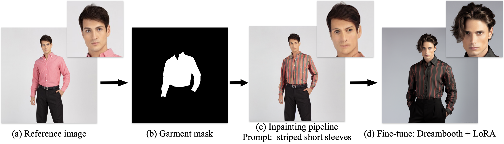

# Generative-Virtual-Try-On

We will make an ambitious attempt to build a project that customizes an generative virtual try-on (VTON) based on any text prompt. The project is in progress, but with some impressive results.



## VTON based on Inpainting pipeline

For this project, we have accomplished the baseline implementation, which is based on the inpainting pipeline provided by [stabilityai](https://huggingface.co/stabilityai/stable-diffusion-2-inpainting) to achieve personalized generative virtual try on by masking the garment area. The pipeline is resumed from [stable-diffusion-2-base](https://huggingface.co/stabilityai/stable-diffusion-2-base) and trained for another 200k steps. Follows the mask-generation strategy presented in [LAMA](https://github.com/advimman/lama).

### Usage

Before running the baseline program, use the [🤗's Diffusers](https://github.com/huggingface/diffusers) library to run Stable Diffusion 2 inpainting in a simple and efficient manner:

```bash
pip install diffusers transformers accelerate scipy safetensors
```

Then run the inpainting pipeline:

```bash
python Baseline_inpainting.py
```
or:

```bash
SAM_+_Stable_Diffusion_Inpainting_Virtue_Try_on.ipynb
```

### Fine-tuning

Although the images generated by the baseline inpainting pipeline achieve virtual try-on to some extent, the performance of the faces and clothing is unsatisfactory. The character's face becomes distorted and the upper body garment appears stiff. Fine-tuning can solve these problems. The project also has built the fine-tune pipeline with Dreambooth + LoRA.

Before running the fine-tuning program, you should download the required environments to ensure the supporting for LoRA:

```bash
pip install -r requirements.txt
```

To run the pipeline applied on Dreambooth and LoRA, please train with the following parameters：

```bash
export MODEL_NAME="stabilityai/stable-diffusion-2-1-base"
export INSTANCE_DIR="./instance_image"
export OUTPUT_DIR="./output"

accelerate launch train_lora_dreambooth.py \
  --pretrained_model_name_or_path=$MODEL_NAME  \
  --instance_data_dir=$INSTANCE_DIR \
  --output_dir=$OUTPUT_DIR \
  --instance_prompt="picture of a sks male model." \
  --train_text_encoder \
  --resolution=512 \
  --train_batch_size=1 \
  --gradient_accumulation_steps=1 \
  --learning_rate=1e-4 \
  --learning_rate_text=5e-5 \
  --color_jitter \
  --lr_scheduler="constant" \
  --lr_warmup_steps=0 \
  --max_train_steps=10000
```


## Reference
[SAM + Stable Diffusion Inpainting](https://colab.research.google.com/drive/1umJUZdqEAcm9GQkzLG-EWXo8_ya-ImRL)

[OutfitAnyone](https://github.com/HumanAIGC/OutfitAnyone)

[lora](https://github.com/cloneofsimo/lora)

[Dreambooth-Stable-Diffusion](https://github.com/XavierXiao/Dreambooth-Stable-Diffusion)

[segment-anything](https://github.com/facebookresearch/segment-anything)

[super-gradients](https://github.com/Deci-AI/super-gradients)


